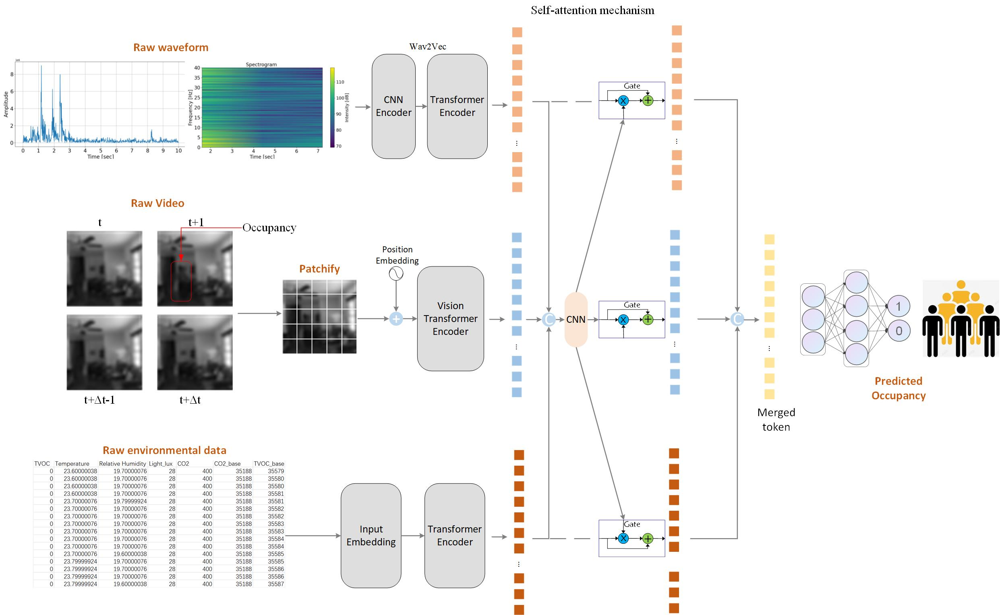

# [DMFF: Deep Multimodel Feature Fusion for Building Occupancy Detection](https://www.sciencedirect.com/science/article/pii/S0360132324001975)


 
 
## Environment
- The code is tested on Ubuntu 20.04.2, python 3.8, cuda 11.1.


## Installation
 1. Clone this repository
  ```bash
  git clone https://github.com/kailaisun/multimodel_occupancy
  ```
  
 2. Install 
  ```bash
  pip install -r requirements.txt
  ```


 ## Test OCC
```Bash
python energysaving.py
```
You will get some plots, which can represent the energy-saving rate.

## Train 

### Multimodel Machine Learning

```Bash
python DT.py
```

### Multimodel CNN

```Bash
python CNN.py
```
### DMFF

```Bash
python trainer.py
```


## Citation

If you use the code or performance benchmarks of this project in your research, please refer to the following bibtex to cite.

```
@article{SUN2024111355,
        title = {DMFF: Deep multimodel feature fusion for building occupancy detection},
        journal = {Building and Environment},
        volume = {253},
        pages = {111355},
        year = {2024},
        issn = {0360-1323},
        doi = {https://doi.org/10.1016/j.buildenv.2024.111355},
        author = {Kailai Sun}
}
```


## License

The repository is licensed under the [Apache 2.0 license](LICENSE).

## Contact Us

If you have other questions❓, please contact us in time 👬


